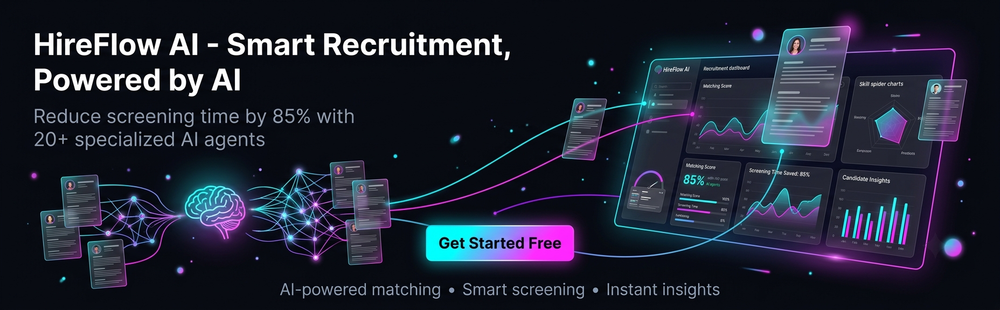

### *"Hire Smarter, Not Harder - AI-Powered Recruitment Revolution"*

[🌐 Live Demo](https://your-demo-link.com) • [🐛 Report Bug](https://github.com/datascientist970/hireflow-ai/issues) • [✨ Request Feature](https://github.com/datascientist970/hireflow-ai/issues)

---

## 📖 Table of Contents

- [About The Project](#about-the-project)
- [Key Features](#key-features)
- [AI Agents](#ai-agents)
- [Technology Stack](#technology-stack)
- [Screenshots](#screenshots)
- [System Architecture](#system-architecture)
- [Roadmap](#roadmap)
- [Contributing](#contributing)
- [License](#license)
- [Contact](#contact)

---

## 🎯 About The Project

**HireFlow AI** is an enterprise-grade recruitment platform that revolutionizes hiring with **20+ specialized AI agents**. Built on Django and powered by Google's Gemini LLM, it automates candidate screening, job matching, and hiring workflows with unprecedented accuracy and speed.

### 🏆 Why Choose HireFlow AI?

<table>
<tr>
<td width="50%">

#### 🚀 Performance Metrics
- ⚡ **85% Faster** screening process
- 🎯 **94% Match** accuracy rate
- 🤖 **20+ AI Agents** working seamlessly
- 💰 **100% Free** core features

</td>
<td width="50%">

#### 💎 Core Benefits
- 🔐 Enterprise-ready security
- 📈 Scalable architecture
- 🌍 Multi-provider AI support
- 🛠️ Fully customizable workflow

</td>
</tr>
</table>

---

## ✨ Key Features

### 👤 For Candidates

<table>
<tr>
<td>

**Profile & Application**
- ✅ Smart profile builder with AI auto-fill
- 📄 Resume upload with automatic parsing
- 🎯 One-click job applications
- ⭐ 5-star rating system for jobs

</td>
<td>

**Job Discovery**
- 🔍 AI-powered job recommendations
- 🔎 Advanced search with 15+ filters
- 📧 Daily/Weekly personalized job alerts
- 💾 Save jobs for later

</td>
</tr>
<tr>
<td>

**Tracking & Communication**
- 📊 Real-time application status tracking
- 📈 9-step hiring pipeline visibility
- 💬 Direct messaging with HR
- 🔔 Instant status change notifications

</td>
<td>

**Career Growth**
- 📚 Skill gap analysis
- 💡 Profile improvement suggestions
- 📊 Application analytics
- 🎓 Learning path recommendations

</td>
</tr>
</table>

### 🏢 For HR / Employers

<table>
<tr>
<td>

**Job Management**
- 📝 Rich text job descriptions
- 🔄 Active/Inactive job toggle
- 🌍 Relocation & sponsorship options
- 🎨 Custom application forms

</td>
<td>

**AI Configuration**
- 🤖 Choose AI provider (Gemini/OpenAI/Claude)
- 🎛️ Custom match threshold settings
- 📊 AI model selection
- 💰 API usage tracking

</td>
</tr>
<tr>
<td>

**Candidate Management**
- 🏆 AI-powered ATS scoring (0-100)
- 📄 Automated resume parsing
- 🔍 Skill gap analysis
- 🧠 Culture fit assessment

</td>
<td>

**Analytics & Reporting**
- 📈 Application funnel metrics
- ⏱️ Time-to-hire statistics
- 📊 Source effectiveness tracking
- 📑 Custom report generation

</td>
</tr>
<tr>
<td>

**Interview Management**
- 📅 Interview scheduling
- ❓ AI-generated interview questions
- 📝 Candidate notes & feedback
- 🎯 Shortlisting tools

</td>
<td>

**Communication**
- 💬 Candidate messaging
- 📧 Email templates
- 🔔 Automated notifications
- 📄 Offer letter generation

</td>
</tr>
</table>

### 🛡️ For Admin

<table>
<tr>
<td>

**Platform Analytics**
- 📊 User growth metrics
- 📈 Job posting trends
- 🤖 AI usage statistics
- 💹 System health monitoring

</td>
<td>

**User Management**
- 👥 Account approval workflow
- 🔒 Lock/unlock user accounts
- 🔑 Password reset utilities
- 👮 Role & permission management

</td>
</tr>
<tr>
<td>

**System Configuration**
- ⚙️ Default AI provider settings
- 📧 Email template management
- 📢 Platform-wide announcements
- 💾 Backup & restore tools

</td>
<td>

**Support & Monitoring**
- 📬 Contact form inbox
- ⭐ System rating overview
- 🐛 Error log monitoring
- 📊 Performance analytics

</td>
</tr>
</table>

---

## 🤖 AI Agents Architecture

### 20+ Specialized AI Agents Working Together

<table>
<tr>
<td width="50%">

#### 📋 Core Analysis Agents (1-10)

1. **📄 Resume Parser**
   - Extracts structured data from resumes
   - Supports PDF, DOC, DOCX formats
   - Identifies skills, experience, education

2. **🎯 Job Matcher**
   - Semantic matching between jobs and candidates
   - Understanding context beyond keywords
   - Multi-dimensional compatibility scoring

3. **🔍 Skill Analyzer**
   - Deep skill assessment and categorization
   - Technical vs soft skill identification
   - Skill proficiency level detection

4. **📊 Experience Evaluator**
   - Evaluates experience quality and relevance
   - Career progression analysis
   - Domain expertise assessment

5. **🧠 Culture Fit Analyzer**
   - Analyzes cultural alignment
   - Company values matching
   - Work style compatibility

6. **📉 Gap Analysis Agent**
   - Identifies skill and experience gaps
   - Suggests learning paths
   - Recommends certifications

7. **❓ Interview Question Generator**
   - Generates personalized interview questions
   - Role-specific and skill-based questions
   - Behavioral question suggestions

8. **💡 Recommendation Engine**
   - Recommends jobs to candidates
   - Suggests candidates to HR
   - Personalized career path suggestions

9. **💰 Salary Predictor**
   - Predicts market salary expectations
   - Location-based compensation analysis
   - Experience-level salary benchmarks

10. **🚩 Red Flag Detector**
    - Detects job hopping patterns
    - Identifies employment gaps
    - Flags inconsistencies in resumes

</td>
<td width="50%">

#### 🎯 Optimization Agents (11-20)

11. **📈 Improvement Suggester**
    - Suggests profile improvements
    - Resume optimization tips
    - Skill enhancement recommendations

12. **🏆 ATS Scorer**
    - Calculates comprehensive ATS scores
    - Multi-factor scoring algorithm
    - Weighted scoring based on requirements

13. **✍️ Job Description Generator**
    - AI-generated job descriptions
    - Industry-standard formatting
    - SEO-optimized content

14. **🔎 Semantic Search Engine**
    - Smart candidate and job search
    - Natural language query support
    - Context-aware search results

15. **⚖️ Bias Detection Agent**
    - Detects and reduces hiring bias
    - Ensures fair evaluation
    - Promotes diversity and inclusion

16. **🥇 Candidate Ranking Agent**
    - Ranks multiple candidates
    - Comparative analysis
    - Priority-based sorting

17. **🔔 Notification Agent**
    - Sends status change notifications
    - Personalized email alerts
    - In-app notification management

18. **📈 Analytics Agent**
    - Generates recruitment analytics
    - Trend analysis and forecasting
    - Custom dashboard creation

19. **💬 Feedback Analyzer**
    - Analyzes candidate feedback
    - Sentiment analysis
    - Improvement insights

20. **✅ Compliance Agent**
    - Checks hiring compliance
    - GDPR and privacy regulations
    - Equal opportunity monitoring

</td>
</tr>
</table>

---

## 🛠️ Technology Stack

### Backend Technologies

### AI & Machine Learning

### Frontend & UI

### DevOps & Deployment

---

## 📸 Screenshots

### 🏠 Home Page
*Clean and modern landing page showcasing key features*

### 👤 Candidate Dashboard
*Personalized dashboard with job recommendations and application tracking*

### 🏢 HR Dashboard
*Comprehensive analytics and candidate management interface*

### 🤖 AI Analysis Results
*Detailed AI-powered candidate assessment with ATS scoring*

### 📊 Analytics & Reports
*Advanced analytics with interactive charts and insights*

### 🛡️ Admin Panel
*Platform-wide monitoring and management tools*

### Multi-Tenant AI Configuration

| Priority | Source | Configuration |
|----------|--------|---------------|
| 🥇 **Highest** | HR Custom Settings | Individual employer chooses AI provider |
| 🥈 **Medium** | System Default | Admin sets platform-wide default |
| 🥉 **Lowest** | Simple Matching | Rule-based matching without AI |

---

## 🗺️ Roadmap

### ✅ Completed (v1.0)
- [x] Core recruitment workflow
- [x] Multi-provider AI integration
- [x] 20+ specialized AI agents
- [x] Role-based access control
- [x] Real-time application tracking
- [x] Analytics dashboard
- [x] Email notifications
- [x] Resume parsing and ATS scoring

### 🚧 In Progress (v1.1)
- [ ] Video interview integration (Zoom/Teams)
- [ ] Mobile responsive optimization
- [ ] Advanced analytics with ML insights
- [ ] Candidate assessment tests
- [ ] Multi-language support

### 🔮 Planned (v2.0)
- [ ] AI-powered video interviews
- [ ] Blockchain-verified credentials
- [ ] Talent pool management
- [ ] Employee referral program
- [ ] REST API for third-party integrations
- [ ] White-label solution for enterprises
- [ ] Mobile app (iOS & Android)
- [ ] Skills-based hiring marketplace

---

## 🤝 Contributing

We welcome contributions from the community! Here's how you can help:

### How to Contribute

1. **Fork** the repository
2. **Create** your feature branch (`git checkout -b feature/AmazingFeature`)
3. **Commit** your changes (`git commit -m 'Add some AmazingFeature'`)
4. **Push** to the branch (`git push origin feature/AmazingFeature`)
5. **Open** a Pull Request

### Development Guidelines

- ✅ Follow PEP 8 style guide for Python code
- ✅ Write meaningful commit messages
- ✅ Add docstrings to all functions and classes
- ✅ Update documentation when needed
- ✅ Write tests for new features
- ✅ Ensure backward compatibility

### Code Review Process

All submissions require review. We use GitHub pull requests for this purpose. Consult [GitHub Help](https://help.github.com/articles/about-pull-requests/) for more information.

---

## 📄 License

This project is licensed under the **MIT License** - see the [LICENSE](LICENSE) file for details.

**TL;DR:** You can use, modify, and distribute this software freely, even for commercial purposes, as long as you include the original license.

---

## 🙏 Acknowledgments

Special thanks to the amazing open-source community and these projects:

- **[Django](https://www.djangoproject.com/)** - The web framework for perfectionists with deadlines
- **[Google Gemini](https://ai.google.dev/)** - Powerful AI capabilities for natural language understanding
- **[OpenAI](https://openai.com/)** - GPT models for advanced text processing
- **[Anthropic](https://www.anthropic.com/)** - Claude AI for intelligent conversations
- **[Bootstrap](https://getbootstrap.com/)** - Responsive UI components
- **[Font Awesome](https://fontawesome.com/)** - Beautiful icons
- **[Chart.js](https://www.chartjs.org/)** - Interactive charts and visualizations

---

## 📞 Contact & Support

### 💬 Get in Touch

### 🐛 Report Issues

Found a bug? [Create an issue](https://github.com/yourusername/hireflow-ai/issues/new?template=bug_report.md)

### ✨ Request Features

Have an idea? [Request a feature](https://github.com/yourusername/hireflow-ai/issues/new?template=feature_request.md)

---

## 📊 Project Stats

---

## ⭐ Show Your Support

If you find this project useful, please give it a ⭐ on GitHub! It helps us reach more developers and grow the community.

### Share HireFlow AI

---

## 🚀 Built with ❤️ by the HireFlow Team

---

**© 2024 HireFlow AI. All Rights Reserved.**

*Empowering recruiters and candidates worldwide with AI-driven hiring solutions.*

